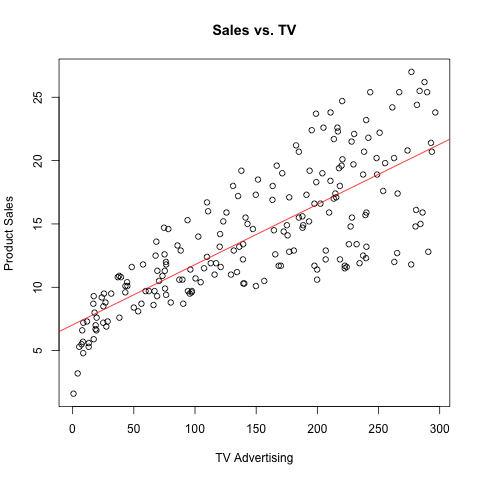

```{r setup, include=FALSE}
knitr::opts_chunk$set(echo = TRUE)
```


```{r echo=FALSE}
load("../data/regression.RData")
library(knitr)
row.names(regression_summary$coefficients)= c("(Intercept)","TV")
kable(regression_summary$coefficients, caption = "Table 1: Information About Regression Coefficients")
Value<-c(sqrt(deviance(regression)/regression$df.residual),regression_summary$r.squared,regression_summary$fstatistic[1])
Quantity<-c("Residual Std. Error", "R Squared", "F-Statistic")
df<-data.frame(Quantity,Value)
kable(df, caption = "Table 2: Regression Quality Indices")
```




